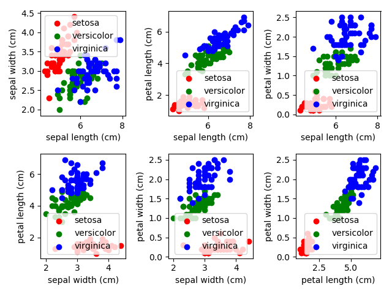
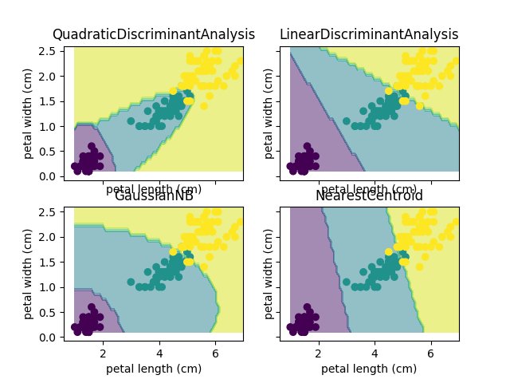
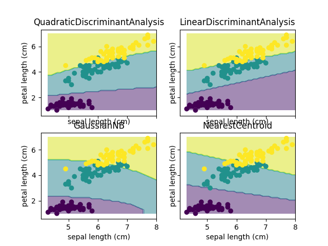
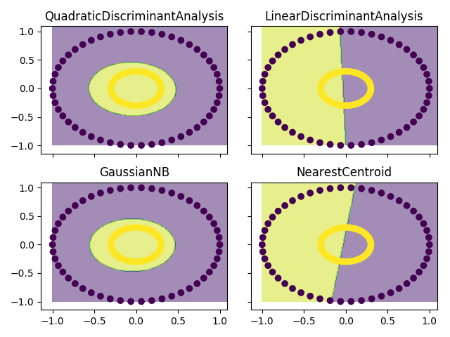
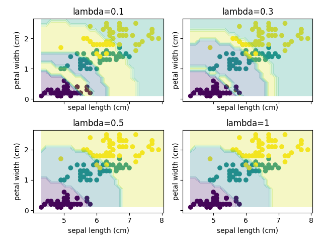
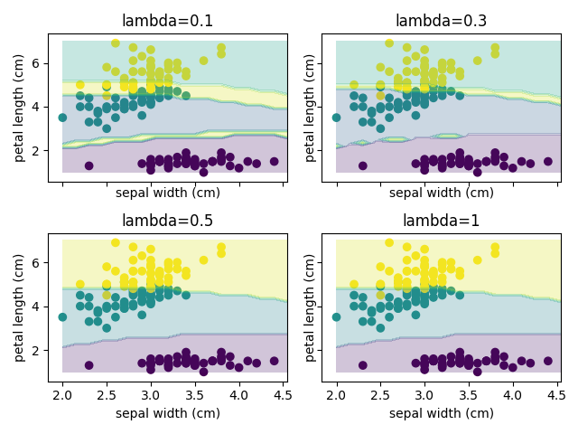

```{r setup, include=FALSE}
knitr::opts_chunk$set(echo = TRUE)
```

# Question 1

Dans cette question, il faut trouver l'estimateur du paramètre $\lambda$ d'une loi exponentielle par la méthode du maximum de vraisemblance. Par la suite, il faut déterminer si cet estimateur est un estimateur sans biais.

## Partie a

On commence avec l'équation de la densité de $x$:

$$
p(x)=\left\{
                \begin{array}{ll}
                  \lambda \exp(-\lambda x), & x \ge0\\
                  0, & x <0
                \end{array}
              \right.
$$

La log-vraisemblance de $p(x)$ est donnée par:

$$
l(x_i;\lambda) = \prod_{i=1}^{n} p(x_i;\lambda) \\ = n log(\lambda) - \lambda \sum_{i=1}^{n}x_i
$$

On trouve l'estimateur du maximum de vraisemblance en dérivant l'équation précédente par rapport à $\lambda$ et en égalisant à zéro:

$$
\frac{dl(x_i:\lambda)}{d\lambda} = \frac{n}{\lambda} - \sum_{i=1}^{n}x_i
$$
En posant égale à zéro, on trouve la valeur de l'estimateur $\hat{\lambda}$:

$$
\hat{\lambda}=\frac{n}{\sum_{i=1}^{n}x_i} = \frac{1}{\bar{X}}
$$

## Partie b

Le biais d'un estimateur est donné par l'équation:

$$
\text{biais}(\hat{\theta})=E[\hat{\theta}] - \theta
$$

Commençons par trouver l'espérance de notre estimateur $\hat{\lambda}$:

$$
E[\hat{\lambda}]=nE\bigg[\frac{1}{\sum_{i=1}^{n}{x_i}}\bigg] = nE[Y^{-1}]
$$
où $Y \sim Gamma(n,1/\lambda)$. On peut trouver $E[Y^{-1}]$ de cette façon:

$$ E[Y^{-1}] = \int_{0}^{\infty}\frac{1}{y}\frac{y^{n-1}\lambda^n\exp(-\lambda y)}{\Gamma(n)}dy $$
$$=\int_{0}^{\infty}\frac{y^{n-2}\lambda^n\exp(-\lambda y)}{\Gamma(n)}dy $$
$$= \frac{\Gamma(n-1)\lambda}{\Gamma(n)}\int_{0}^{\infty}\frac{y^{(n-1)-1}\lambda^n\exp(-\lambda y)}{\Gamma(n-1)}dy $$
$$= \frac{\Gamma(n-1)\lambda}{\Gamma(n)} = \frac{\lambda}{n-1}$$

On peut ensuite trouver le biais de l'estimateur:

$$
\text{biais}(\hat{\lambda})=E[\hat{\lambda}] - \lambda = nE[Y^{-1}]-\lambda \\
= n\frac{\lambda}{(n-1)}-\lambda=\frac{\lambda}{n-1}
$$

On peut donc conclure que l'estimateur $\hat{\lambda}$ a un biais de $\frac{\lambda}{n-1}$. Il est toutefois asymptotiquement sans biais.

# Question 2

Dans la question 2, nous utiliserons le jeu de données Iris de Fisher et nous construirons différents classifieurs qui nous permettront de faire la classification supervisée des 3 types de fleurs présents dans le jeu de données.

## Partie a

Voici des graphiques (figure 1) montrant la distribution des données selon les classes (3 types de fleurs) en 2 dimensions pour chacune des combinaisons de variables du jeu de données.



En analysant les distributions de la figure 1, on remarque que les relations entres les variables sont assez variées. On remarque également la classe setosa semble souvent plus différent que les autres, ce qui nous laisse croire que nous pourrons peut-être mieux classifier cette catégorie de fleur. Les deux autres classes semblent plus difficiles à distinguer dans certains contextes, par exemple le premier graphique en haut à gauche. En général, il est réaliste de croire que nous pourrons faire une bonne classification sur ces données.

## Partie b

Le tableau ci-dessous montre les résultats pour chacun des classifieurs entraînés et testés pour cette question. Le classifieurs demandé à la sous-question (i) correspond à l'analyse discriminante quadratique (QDA), celui de la sous-question (ii) à l'analyse discriminante linéaire (LDA), celui de la sous-question (iii) au classifieur naïf Bayes Gaussien (Gaussian NB) alors que la sous-question (iv) correspond au classifieur des plus proches centroïdes (Nearest Centroid).

$$
\begin{tabular}{ |p{3cm}||p{2cm}|p{2cm}|p{2cm}|p{2cm}|  }
 \hline
 Variables & QDA & LDA & Gaussian NB & Nearest Centroid \\
 \hline
 Sepal length - Sepal width & 0.2 & 0.2 & 0.22 & 0.19 \\
 \hline 
 Sepal length - Petal length & 0.04 & 0.03 & 0.09 & 0.11 \\
 \hline
 Sepal length - Petal width & 0.03 & 0.04 & 0.04 & 0.15 \\
 \hline
 Sepal width - Petal length & 0.05 & 0.05 & 0.08 & 0.06 \\
 \hline
 Sepal width - Petal width & 0.05 & 0.03 & 0.05 & 0.06 \\
 \hline
 Petal length - Petal width & 0.02 & 0.04 & 0.04 & 0.04 \\
 \hline
\end{tabular}
$$

À la lumière des résultats présentés dans le tableau ci-dessus, on remarque que le classifieur LDA, soit celui qui comprend une matrice de covariance $\Sigma$ complète et partagée entre les classes, semble être le plus approprié en termes de complexité. La complexité additionnelle apportée par le QDA n'est pas nécessaire si on regarde la différence au niveau des erreurs qui est minime. Par exemple, la figure 2 illustre bien un exemple où est-ce que le niveau de complexité additionnelle du QDA ne semble pas nécessaire.



Les deux autres modèles (Gaussian NB et Nearest Centroids) semblent avoir plus de difficultés dans certains contextes, donc on pourrait penser que leur niveau de complexité n'est pas suffisant. Par exemple, la figure 3 montre bien que les modèles QDA et LDA sont meilleurs pour représenter la complexité des données.



## Partie c

Pour chacune des sous-questions de cette section, nous utiliserons le modèle QDA. Nous utiliserons également les 4 variables du jeu de données Iris.

### Partie i

Dans cette partie, nous entraînons le modèle sur la totalité du jeu de données. L'erreur empirique rapportée est de **0.02**. Cette erreur n'est probablement pas représentative de la véritable erreur que nous devrions nous attendre dans la réalité. En effet, étant donné que le modèle s'entraîne sur tous les exemples, ce modèle à probablement fait de la surapprentissage et sous-estime donc l'erreur réelle.

### Partie ii

Pour éviter le genre de problème rapporté dans la section (i), il est souvent recommandé de séparer le jeu de données en différents jeux de données afin de tester les performances du modèles sur des données que celui-ci n'a jamais vues.

Dans cette partie, nous avons divisé le jeu de données en 2 et avons donc entraîné celui-ci sur 50% seulement. L'erreur empirique moyenne pour cette expérience, répétée à 10 reprises et calculée sur le 50% restant, est de **0.0267**. Comme nous l'avions anticipé plus tôt, l'erreur en (i) était fort probablement sous-estimée.

### Partie iii

Une autre alternative pour mesurer les performances du modèles est d'utiliser la méthode des k-plis. La méthode consiste à séparer le jeu de données en k partitions, entraîner le modèle sur k-1 partitions et tester sur la partition restante. On répète ensuite les deux dernières étapes afin d'avoir testé toutes les partitions une fois.

Après avoir répété cette expérience à 10 reprises, on obtient une erreur de **0.028**, ce qui est d'ailleurs très près de l'estimation obtenue en (ii). Dépendemment des situations, les deux méthodes utilisées pour mesurer la performances peuvent être adéquates.

## Partie d

Le tableau ci-dessous montre les erreurs empiriques de chacun des 4 classifieurs sur le jeu de données de validation provenant d'un exemple créé à partir de la fonction `make_circles`.

$$
\begin{tabular}{ |p{3cm}||p{2cm}|p{2cm}|p{2cm}|p{2cm}|  }
 \hline
  & QDA & LDA & Gaussian NB & Nearest Centroid \\
 \hline
 Erreur empirique & 0 & 0.48 & 0 & 0.5 \\
 \hline 
\end{tabular}
$$

Étant donné que nous avons une distribution de données en cercle, il est évident qu'un classifieur linéaire comme le LDA ne pourra bien performer. Dans un tel contexte, des classifieurs plus complexes, mais surtout non linéaires, comme le QDA et le Gaussian NB sont beaucoup plus appropriés. La figure 4 illustre bien le fait que ces deux derniers peuvent créer des zones de décisions non linéaires qui permettent d'obtenir une erreur nulle. Étant donné que le classifieur Gaussian NB a moins de paramètres à estimer que le QDA, et a les mêmes résultats, il serait préférable de choisir le Gaussian NB.



# Question 3

## Partie a

L'estimation du paramètre $\sigma_i$ se fait en dérivant la fonction de vraisemblance par rapport au paramètre en question et en égalant l'équation à zéro:

$$
h_i(x)=P(C_i|x)=P(X|C_i) \times P(C_i)
$$
On peut donc dire que la vraisemblance est proportionnelle à la transformation log:

$$
h_i(x)=log(P(C_i|x)=P(X|C_i))+log(P(C_i))
$$
où $P(X|C_i)) \sim N_D(\mu_i, \Sigma_i)$. En ajoutant la densité normale et en développant nous obtenons que :

$$
h_i(x) =\frac{-D}{2}log(2\pi)-\frac{1}{2}log|\Sigma_i|-\frac{1}{2}(\textbf{x}-\mu_i)^T\Sigma_i^
{-1}(\textbf{x}-\mu_i) + log(P(C_i))
$$

si on garde seulement les éléments qui sont fonction de notre paramètre à estimer:

$$
h_i(x) =-\frac{1}{2}log|\Sigma_i|-\frac{1}{2}(\textbf{x}-\mu_i)^T\Sigma_i^
{-1}(\textbf{x}-\mu_i)
$$

Sachant que $\Sigma_i=\sigma_iI$ alors :

$$
h_i(x) =-\frac{1}{2}log(\sigma_i^{2D})-\frac{1}{2\sigma_i^2}(\textbf{x}-\mu_i)^TI^
{-1}(\textbf{x}-\mu_i)
$$

Si on dérive par rapport à $\sigma_i^2$ et on pose égale à zéro on obtient:

$$
\frac{dh_i(x)}{d\sigma_i^2}=\frac{-D}{2\sigma_i^2}+\frac{1}{2(\sigma_i^2)^2}(\textbf{x}-\mu_i)^T(\textbf{x}-\mu_i)
$$
$$
\hat{\sigma_i}^2=\frac{(\textbf{x}-\mu_i)^T(\textbf{x}-\mu_i)}{D}
$$

## Partie b

Avec un option de rejet, voici l'équation qui permet d'obtenir la probabilité $P(C_i|x)$ et la fonction qui permet de prendre la décision qui minimise le risque:

$$
P(C_i|x)=\frac{P(x|C_i)P(C_i)}{\sum_{i=1}^{k}P(x|C_i)P(C_i)}
$$

où $P(x|C_i) \sim N_D(\mu_i, \sigma_i)$.

$$
\alpha_i=\left\{
                \begin{array}{ll}
                  \alpha_{K+1}, & si P(C_j|x) <  1 - \lambda \forall j =1 ... k\\
                  argmax_{\alpha_i=\alpha_1}^{\alpha_k} P(C_j|x), & autrement
                \end{array}
              \right.
$$

## Partie c

Voir le code.

## Partie d

Dans cette sous-question, il faut utiliser notre implémentation du classifieur avec rejet et tester différentes valeurs $\lambda$ pour le niveau de confiance associé au rejet. Le tableau ci-dessous montre les résulats d'erreurs empiriques pour chaque combinaisons et chaque scénario de rejet.

$$
\begin{tabular}{ |p{3cm}||p{2cm}|p{2cm}|p{2cm}|p{2cm}|  }
 \hline
 Variables/lambda & 0.1 & 0.3 & 0.5 & 1 \\
 \hline
 Sepal length - Sepal width & 0.09 & 0.2 & 0.2 & 0.2 \\
 \hline 
 Sepal length - Petal length & 0.04 & 0.09 & 0.07 & 0.07 \\
 \hline
 Sepal length - Petal width & 0.06 & 0.12 & 0.13 & 0.13 \\
 \hline
 Sepal width - Petal length & 0.03 & 0.05 & 0.05 & 0.05 \\
 \hline
 Sepal width - Petal width & 0.04 & 0.07 & 0.05 & 0.05 \\
 \hline
 Petal length - Petal width & 0.02 & 0.03 & 0.04 & 0.04 \\
 \hline
\end{tabular}
$$

Le tableau ci-dessus montre que le fait de définir une option de rejet semble être bénéfique pour les résultats du classifieur. En effet, si on compare les résultats du modèle qui ne rejette aucune donnée ($\lambda=1$) avec le modèle qui rejette seulement quelques données ($\lambda=0.1$), le dernier semble meilleur sur toutes les paires de variables. Intuitivement, cela est sensé puisqu'en ayant une valeur de $\lambda$ faible, cela fait en sorte qu'on rejette de classifier la donnée seulement si la classe la plus vraisemblable n'est pas très probable en bout de ligne. Cela veut donc dire que le classifieur a de la difficulté à bien identifier les patterns qui permettent de classifier les données dans cette zone en particulier.

Les figures 5 et 6 sont respectivement des exemples de combinaisons de variables pour lesquelles l'option de rejet est utile et où elle est peu utile.





En conclusion, l'option de rejet devient une alternative intéressante lorsque les données présente des régions où est-ce qu'il est difficile de bien apprendre la représentation des données. 
