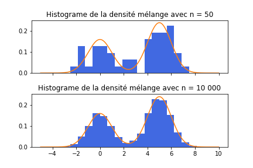
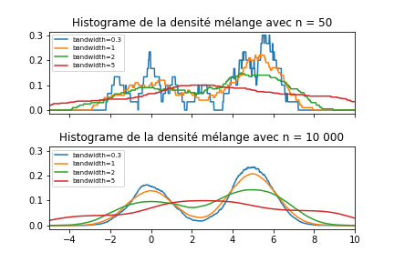
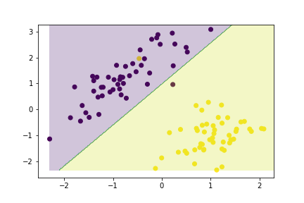
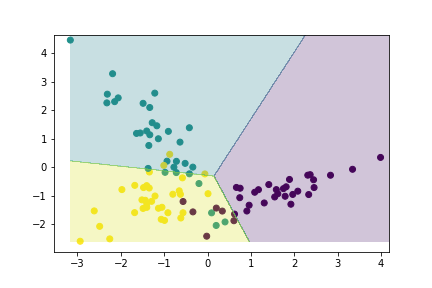
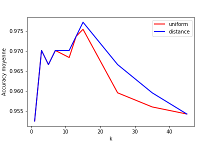
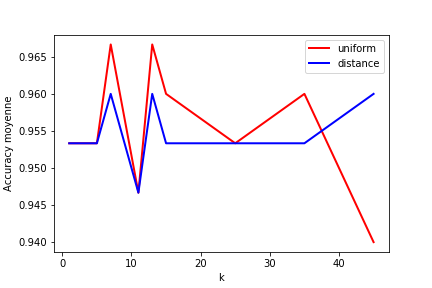

```{r setup, include=FALSE}
knitr::opts_chunk$set(echo = TRUE)
```

# Question 1

Dans cette question, l'objectif est d'estimer de manière non-parametrique la densité d'une loi de mélange entre deux lois normales.

## Partie a

Dans la première partie, nous estimerons la densité de la loi mélange par la méthode de l'histogramme. La figure 1 illustre la densité de la loi en échantillonant 50 et 10 000 observations de la loi mélange.



Dans la figure 1, la ligne orange correspond à la courbe de densité réelle de la loi mélange. On remarque qu'avec 50 observations, l'estimation de la densité n'est pas très précise alors qu'avec 10 000 observations, on se rapproche beaucoup plus de la vraie densité.

## Partie b

Dans cette partie, nous estimerons encore la densité de la loi de mélande, mais cette fois-ci avec une estimation par noyau *boxcar*. Cette méthode d'estimation n'est pas continue, mais elle évite de devoir poser une origine alors qu'une fenêtre est appliquée à chaque valeur du support. La figure 2 illustre l'estimation de la densité avec 50 et 10 000 observations selon différentes valeurs de *bandwidth* ($h$). Cette dernière valeur, contrôle la largeur de la fenêtre autour de laquelle nous allons considérer les données autour d'un point $x$ du support.



À partir de la figure 2, on peut remarquer 2 choses. Premièrement, moins il y a d'observations, plus il y a de variations dans les estimations de la densité pour les valeurs du support. Cela se voit par les escaliers plus prononcés dans la figure avec 50 observations seulement. Deuxièment, plus la fenêtre d'estimation (*bandwidth*) est grande, plus la densité est constante sur le support. Cela fait du sens puisqu'avec une grande fenêtre, on considère beaucoup de données pour estimer la densité en un point. Si la fenêtre est petite, on donnne plus d'importance à la densité locale ce qui fait en sorte qu'on remarque davantage les deux cloches normales. 

## Partie c

Les méthodes d'estimation par noyau et la méthode des $k$-PPV sont tous des méthodes non-paramétriques utilisées pour estimer des densités. La principale différence entre les deux types de méthodes est que la fenêtre $h$, qui définit l'influence des données autour d'un point, est fixe pour les méthodes par noyau, mais flexible pour la méthode basée sur le $k$-PPV. Pour cette dernière, la fenêtre s'ajuste en fonction de la densité locale des données.

Par exemple, si une observation est située très loin dans l'espace par rapport aux autres observations, la méthode basée sur les $k$-PPV va tout de même chercher les $k$ observations les plus proches. Dans ce cas-ci, la fenêtre $h$ sera très grande. C'est une des raisons pourquoi que les méthodes par noyau sont mieux adaptées pour estimer des densités. Ces dernières vont considérer une fenêtre $h$ fixe, ce qui fera en sorte que la densité sera pratiquement nulle pour cette observation.  

## Partie d

La méthode basée sur les $k$-PPV est relativement bien adaptée pour le classement et la régression. En effet, cette méthode est très simple et intuitive dans un contexte de modélisation. Pour ce qui est de l'estimation de la densité, cette méthode souffre du problème mentionné à la partie c). 

# Question 2

## Partie a

Dans cette première partie, il faut faire le développement mathématique qui nous permettra de calculer l'ajustement à faire sur les paramètres $w_i$ de notre discriminant linéaire. Pour ce faire, il faut calculer la dérivée de notre critère d'erreur par rapport à chacun de nos paramètres $w_i$.

Il faut donc calculer:

$$
\triangledown_w E = \Bigg[\frac{\partial E}{\partial w_0}, \frac{\partial E}{\partial w_1}, ..., \frac{\partial E}{\partial w_D} \Bigg]
$$
Ces dérivées partielles nous indiqueront les ajustements à apporter sur chacun des paramètres $w_i$ pour chacune des itérations effectuées lors de la descentre du gradient. La mise à jour pourra s'effectuer comme suit:

$$
w_i = w_i+\Delta w_i
$$
où $\Delta w_i = -\eta \frac{\partial E}{\partial w_i}$ pour $i=0, ..., D$.

Pour $i=1,...,D$, la dérivée partielle se développe comme suit:

$$
\frac{\partial E}{\partial w_i}=\frac{\partial \Big(\frac{1}{2} \sum_{x^t\in Y} \frac{[r^t-(\textbf{w}^T \textbf{x} + w_0)]^2}{||\textbf{x}^t||^2}\Big)}{\partial w_i}
$$

$$
=-2 \times \frac{1}{2} \sum_{x^t\in Y} \frac{[r^t-(\textbf{w}^T \textbf{x} + w_0)]}{||\textbf{x}^t||^2}\times x_i^t
$$
$$
=-\sum_{x^t\in Y} \frac{[r^t-(\textbf{w}^T \textbf{x} + w_0)]}{||\textbf{x}^t||^2}\times x_i^t
$$
où $Y$ correspond à l'ensemble des données mal classées.

Pour $i=0$, la dérivée partielle se développe de manière similaire comme suit:

$$
\frac{\partial E}{\partial w_0}=\frac{\partial \Big(\frac{1}{2} \sum_{x^t\in Y} \frac{[r^t-(\textbf{w}^T \textbf{x} + w_0)]^2}{||\textbf{x}^t||^2}\Big)}{\partial w_0}
$$
$$
=-2 \times \frac{1}{2} \sum_{x^t\in Y} \frac{[r^t-(\textbf{w}^T \textbf{x} + w_0)]}{||\textbf{x}^t||^2}
$$
$$
=-\sum_{x^t\in Y} \frac{[r^t-(\textbf{w}^T \textbf{x} + w_0)]}{||\textbf{x}^t||^2}
$$

Au final, on peut définir les ajustement à apporter aux paramètres $w_i$ comme suit:

$$
\Delta w_i=\left\{
                \begin{array}{ll}
                  \eta \times \sum_{x^t\in Y} \frac{[r^t-(\textbf{w}^T \textbf{x} + w_0)]}{||\textbf{x}^t||^2}\times x_i^t, & i \ge1\\
                  \eta \times \sum_{x^t\in Y} \frac{[r^t-(\textbf{w}^T \textbf{x} + w_0)]}{||\textbf{x}^t||^2}, & i =0
                \end{array}
              \right.
$$

## Partie b

Voir le code.

## Partie c

Dans cette partie, nous allons tester le discriminant que nous avons définit à la partie a) et implémenté dans la partie c). Tout d'abord, nous allons tester la performance de celui-ci sur un jeu de données à deux classes. Pour ce jeu de données, le discriminant linéaire a une *accuracy* de 98%. Cette performance est calculée sur la totolité du jeu de données. La figure 3 illustre les zones de décision calculées par le discriminant. 



On remarque que les zones définies par le discriminant à 2 classes classifient très bien le jeu de données. Ensuite, nous allons tester la performance du même discriminant linéaire, mais cette fois-ci, sur un jeu de données à 3 classes. Étant donné que notre modèle permet de discriminer une classe versus une autre, nous allons utiliser l'approche un contre tous afin d'itérer sur chaque combinaison de classe et ainsi se ramener à plusieurs classifications binaires. La figure 4 illustre les zones de décisions tracées par ce classfieur un contre tous, qui obtient une *accuracy* de 84% sur la totalité du jeu de données. 



On remarque que les zones de décisions séparent relativement bien le jeu de données. 

## Partie d

Dans cette partie, nous allons comparer les résultats de notre discriminant linéaire avec d'autres classifieurs. En effet, nous allons également tester:

- La méthode paramétrique de la loi normale multivariée
- Descente du gradient avec le critère du perceptron
- Regression logistique

De plus, nous allons tester ces modèles sur différents jeux de données à 2 et à 3 classes. Nous allons également avoir une meilleure idée de la performance réelle des modèles alors que nous allons estimer l'*accuracy* moyenne par validation croisée (K = 3 plis). 

### Comparaison des paramètres entre les modèles

Comme nous l'avons définit dans les premières parties, notre discriminant linéaire possède $D+1$ paramètres à estimer, soit les $w_i$ pour $i=0, ..., D$. Ces paramètres sont estimés par une descente du gradient qui requiert 3 autres hyper-paramètres, soit les paramètres $\epsilon$, le nombre d'itérations maximal et $\eta$. Les deux premiers servent en quelque sorte de critères d'arrêt pour la descente du gradient. En effet, $\epsilon$ contrôle l'amélioration minimale pour continuer d'itérer, alors que le nombre maximum d'itérations contrôle le nombre d'ajustements maximal apporté sur les $w_i$. Le paramètre $\eta$ contrôle pour sa part la vitesse de la descente du gradient. C'est un facteur qu'on applique aux ajustement afin de ne pas faire de trop "gros" pas vers la valeur à atteindre.

Pour le modèle basée sur la méthode paramétrique de la loi normal multivariée, l'algorithme doit trouver les paramètres $\mu$ et $\Sigma$ de la loi normale. La matrice de covariance est toutefois partagée entre les classes, ce qui réduit le nombre de paramètre à estimer. C'est d'ailleurs pour cette raison qu'on parle d'un discriminant linéaire, et non quadratique dans le cas ou les matrices de covariances sont spécifiques à chaque classe.

La méthode basée sur le perceptron ressemble beaucoup à notre discrimant linéaire décrit dans les premières parties de la question. Il estime les paramètres $w_i$ par une descente du gradient, mais le critère d'erreur est définit différemment. Les hyper-paramètres sont d'ailleurs très similaires à ceux décrits plus tôt.

Pour finir, la régression logistique trouve des valeurs de $\beta_i$ à appliquer aux différentes variables de $X$. Cela ressemble beaucoup aux $w_i$ calculés dans la méthode du perceptron. Toutefois, les paramètres ne sont pas estimés par une descente du gradient, mais plutôt par la méthode du maximum de vraisemblance, qu'on peut d'ailleurs appliquée en raison de certaines hypothèses faites sur le modèles.

### Comparaison des performances

Le tableau ci-dessous compare les performances pour chacun des modèles sur le jeu de données *Breast cancer Wisconsin*. La métrique utilisée est l'*accuracy* moyenne sur les 3 sous-ensembles de la validation croisée.

$$
\begin{tabular}{ |p{8cm}||p{4cm}|  }
 \hline
 Modèle & Accuracy moyenne \\
 \hline
 Discriminant linéaire & 0.9437  \\
 \hline 
 Normale multivariée (LDA) & 0.9437 \\
 \hline
 Perceptron & 0.9631 \\
 \hline
 Régression logistique & 0.9525  \\
 \hline
\end{tabular}
$$
Le deuxième tableau compare encore une fois les performances pour chacun des modèles, mais cette fois-ci sur le jeu de données *Iris*. Une fois de plus, la métrique utilisée est l'*accuracy* moyenne sur les 3 sous-ensembles de la validation croisée.

$$
\begin{tabular}{ |p{8cm}||p{4cm}|  }
 \hline
 Modèle & Accuracy moyenne \\
 \hline
 Discriminant linéaire & 0.66  \\
 \hline 
 Normale multivariée (LDA) & 0.98 \\
 \hline
 Perceptron & 0.69 \\
 \hline
 Régression logistique & 0.84  \\
 \hline
\end{tabular}
$$
En comparant les performances sur les deux jeux de données, on remarque que le discriminant linéaire et la méthode basée sur le perceptron sont beaucoup moins performantes sur un jeu de données à 3 classes. La méthode basée sur la loi normale multivariée semble être beaucoup plus robuste. De plus, le temps de calcul pour celle-ci est très rapide pour ces jeux de données. La regression logistique possède également d'assez bons résultats sur les deux jeux de données. De plus, le nombre de paramètres à estimer par cette méthode est moins grand que pour la méthode basée sur la loi normale multivariée.

## Partie e

Pour finir, nous allons tester un modèle des *k*-PPV sur les deux jeux de données utilisés en d). Pour évaluer les performances, nous utiliserons la méthode *leave-one-out*, qui consiste essentiellement à faire une validation croisée avec le nombre de plis égale au nombre d'observations.

Les figures 5 et illustrent les performances (*accuracy* moyenne) pour le classifieur *k*-PPV avec différentes valeurs de k et aussi selon le paramètre de poids. Quand le paramètre est "uniform", cela veut dire que tous les *k*-PPV ont le même poids dans la classification. Quand le paramètre est "distance", cela veut dire que les *k*-PPV sont pondérés par rapport à leur distance de l'observation à classifier.





Pour les deux jeux de données, on semble remarquer un *pattern* légèrement similaire. On voit qu'avec un nombre de voisins trop petit ($k$ faible), les performances du modèles ne sont pas très bonnes. Dans cette situation, le modèle est fort probablement en situation de sur-apprentissage. Lorsqu'on augmente le nombre de voisins, le modèle semble être meilleur pour généraliser. Toutefois, avec une valeur de $k$ trop élevée, les performances rechutent. Cela indique probablement une situation de sous-apprentissage.

Pour ce qui est de la méthode utilisée pour pondérer les *k*-PPV, on remarque que cela n'a peu d'importance lorsque le nombre de voisins est petit. Plus le nombre de voisins considérés augmente, plus la méthode basée sur la distance est performante. Cela est assez intuitif, car plus $k$ est élevé, plus il y a plus de risque d'inclure des voisins peu "similaires". La méthode qui pondère avec la distance vient donc un peu contrer ce phénomène.