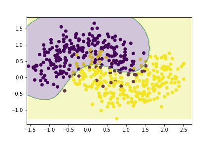

```{r setup, include=FALSE}
knitr::opts_chunk$set(echo = TRUE)
```

# Question 1

Dans cette question, il faut développer les équations nous permettant de trouver les ajustements à apporter aux poids du modèle. Il faut trouver ces développements pour la couche de sortie et pour la couche cachée.

## La couche de sortie

On trouve l'ajustement en trouvant la dérivée de l'erreur par rapport aux paramètres de poids de la couche de sortie:

$$
\Delta w_{j,i} = -\eta \frac{\partial E}{\partial w_{j,i}}= \frac{-\eta}{N} \sum_{t=1}^{N} \frac{\partial E^t}{\partial w_{j,i}}
$$

Avec les dérivés en chaînes on peut trouver :

$$
\frac{\partial E^t}{\partial w_{j,i}}=\frac{\partial E^t}{\partial e_{j}^t}\frac{\partial e_{j}^t}{\partial y_{j}^t}\frac{\partial y_{j}^t}{\partial a_{j}^t}\frac{\partial a_{j}^t}{\partial w_{j,i}}
$$

Ensuite, on peut trouver chacune de ces composantes:

$$
\frac{\partial E^t}{\partial e_{j}^t}=\frac{\partial}{\partial e_{j}^t}\Big[\frac{1}{2}\sum_{l=1}^K(e_l^t)^2\Big] = e_j^t
$$

$$
\frac{\partial e_j^t}{\partial y_{j}^t}=\frac{\partial}{\partial y_j^t}(r_i^t-y_i^t)=-1
$$

$$
\frac{\partial y_j^t}{\partial a_{j}^t}=\frac{\partial}{\partial a_j^t}\Bigg[\frac{exp(2a_j^t)-1}{exp(2a_j^t)+1}\Bigg]=\frac{4exp(2a_j^t)}{(exp(2a_j^t)+1)^2}=(1-(y_j^t)^2)
$$

$$
\frac{\partial a_j^t}{\partial w_{j,i}}=\frac{\partial}{\partial w_{j,i}}\sum_{l=1}^R
 w_{j,i}y_l^t+w_{j,0}=y_i^t
 $$
si $i=1 ...K$ ou $1$ si $i=0$. Au final, on peut définir l'ajustement des poids comme suit:

$$
\Delta w_{j,i}=\left\{
                \begin{array}{ll}
                  \frac{\eta}{N} \times \sum_{t=1}^N e_j^t(1-(y_j^t)^2)y_i^t, & i \ge1\\
                  \frac{\eta}{N} \times \sum_{t=1}^N e_j^t(1-(y_j^t)^2), & i =0
                \end{array}
              \right.
$$

## La couche cachée

Un peu de la même façon, on peut trouver l'ajustement à faire sur les paramètres de la couche couchée:

$$
\frac{\partial E^t}{\partial w_{j,i}}=\frac{\partial E^t}{\partial y_{j}^t}\frac{\partial y_{j}^t}{\partial a_{j}^t}\frac{\partial a_{j}^t}{\partial w_{j,i}}
$$

La première dérivée, soit $\frac{\partial E^t}{\partial y_{j}^t}$ se trouve d'une manière un peu différente, mais les développements restent très similaires à ceux de la couche de sortie. Au final, on arrive avec l'ajustement suivant:

$$
\Delta w_{j,i}=\left\{
                \begin{array}{ll}
                  \frac{\eta}{N} \times \sum_{k=1}^K e_k^t(1-(y_j^t)^2)y_i^t, & i \ge1\\
                  \frac{\eta}{N} \times \sum_{t=1}^N e_j^t(1-(y_j^t)^2), & i =0
                \end{array}
              \right.
$$

# Question 2

Pour cette question, l'objectif est de tester différents classifieurs sur le jeux de données *Pendigits* et de faire la recherche des meilleurs hyperparamètres. Pour faire cela, une méthode classique consiste à faire la recherche en grille, où on essayera différentes combinaisons d'hyperparamètres pour voir laquelle a les meilleures performances.

Nous entraînerons les 3 classifieurs suivants:

1. Un classifieur par les $k$-PPV avec distance euclidienne
2. Un séparateur à vastes marges avec noyau gaussien
3. Un perceptron multicouche

## Partie a

Avant même de faire la recherche en grille, il faut d'abord identifier quels hyperparamètres de nos algorithmes sont les plus importantes et définir les combinaisons à tester pour ces hyperparamètres.

Pour le classifieur par $k$-PPV, le nombre de voisins (*n_neighbors*) est un hyperparamètre évident à considérer. Celui-ci contrôle entres autres le compromis biais-variance de l'algorithme. De plus, nous allons également considérer l'hyperparamètre de poids (*weights*) qui donne un niveau d'importance aux points dans le voisinage de la valeur à prédire. Voici les valeurs testées :

```{py}
n_neighbors = [1, 3, 5, 10, 20, 50, 100]
weights = ["uniform", "distance"]
```

Pour le SVM, l'hyperparamètre $C$ est un choix évident étant donné qu'il contrôle la pénalité appliquée sur les erreurs faites par le modèle. Étant donné que notre SVM à un noyau gaussien, il est pertinent de tester plusieurs valeurs de gamma (*gamma*). Ce dernier contrôle le la forme du noyau gaussien. Voici les différentes valeurs testées :

```{py}
C = [0.01, 0.1, 1, 10, 100, 1000]
gamma = [0.1, 0.2, 0.5]
```

Pour le perceptron multicouche, il existe énormément de combinaisons d'hyperparamètres étant donné la nature plus complexe de ce type de classifieur. Dans notre cas, nous nous tiendrons à tester plusieurs types de fonctions d'activation (*activation*) et aussi plusieurs nombres différents de couches cachées (*hidden_layer_sizes*). Le premier nous permettra de créer différents types de non-linéarités, alors que le deuxième nous permettra de faire la compositionnalité de l'apprentissage. Voici les valeurs testées :

```{py}
hidden_layer_sizes = [ 10, 100, 500, 1000]
activation = ['relu', 'identity', 'tanh', 'logistic']
```

## Partie b

Pour la deuxième partie, il fallait appliquer les différentes combinaisons d'hyperparamètres définit plus tôt afin de trouver la combinaison optimale. Pour faire la recherche en grille, nous avons tout d'abord séparé le jeu de données en jeu d'entraînement et en jeu de test. Par la suite, nous avons procédé à une validation croisée ($K=5$) sur le jeu d'entraînement pour chaque combinaison d'hyperparamètres. De cette façon, nous avons pu trouver la combinaison optimale sans même utiliser le jeu de données test.

Voici un tableau résumant les performances optimales obtenues pour chacun des classifieurs. Nous avons retenu les combinaisons apportant la meilleure précision en validation croisée.

$$
\begin{tabular}{ |p{2cm}|p{4cm}|p{4cm}|p{4cm}|  }
 \hline
 Classifieur & Hyperparamètres optimaux & Précision sur le jeu de données entraînement & Précision sur le jeu de données test \\
 \hline
 kPPV & nb. neighbors: 3, weights: distance & 1 & 0.9923 \\
 \hline
 SVM & C:10, gamme: 0.5 & 0.9986 & 0.9961 \\
 \hline
 MLP & hidden layer sizes: 100, activation: relu & 0.9932 & 0.9882 \\
 \hline
\end{tabular}
$$

On remarque que les 3 classifieurs sont très performants, autant sur le jeu de données d'entraînement que sur le jeu de données test.

# Question 3

Pour cette question, la tâche consistait à implanter un discriminant avec noyau gaussien qui serait optimisé par descente du gradient.

## Partie a

Dans l'optique d'implanter la descente du gradient dans notre classe, il faut d'abord définir les équations de gradient pour les paramètres de notre modèle. Les gradients sont trouvés en dérivant la fonction d'erreur par rapport aux paramètres désirés. On commence en trouvant le gradient pour $w_0$:

$$
\frac{\partial E}{\partial w_0}=\frac{\partial}{\partial w_0}\sum_{x^t \in Y}\Big[1-r^t(\sum_{x^s \in X} \alpha^s r^s K(x^s, x^t) + w_0)\Big] + \lambda \sum_{\alpha^t \in \alpha}\alpha^t=\sum_{x^t \in Y}-r^t
$$

Ensuite on trouve le gradient pour $\alpha^k$:

$$
\frac{\partial E}{\partial \alpha^k}=\frac{\partial}{\partial \alpha^k}\sum_{x^t \in Y}\Big[1-r^t(\sum_{x^s \in X} \alpha^s r^s K(x^s, x^t) + w_0)\Big] + \lambda \sum_{\alpha^t \in \alpha}\alpha^t=\sum_{x^t \in Y} -r^t r^kK(x^s,x^t) + \lambda
$$

## Partie b

Pour l'implémentation, voir le code.

## Partie c

Maintenant que nous avons implémenté notre discriminant dans une classe, il nous reste plus qu'à le tester. Pour ce faire, nous allons utiliser un jeu de données synthétiques de 1000 observations que nous allons séparer en 2 jeux de données (entraînement et test).

L'objectif est de trouver une paramétrisation nous permettant d'obtenir un taux d'erreur inférieur à 10%. Pour trouver les bons hyperparamètres de notre discriminant, nous allons procéder par une recherche en grille. Nous avons 2 hyperparamètres à trouver. L'hyperparamètre $\lambda$ contrôle la régularisation de notre algorithme. L'hyperparamètre $\sigma$ contrôle quant à lui le noyau gaussien. Voici les valeurs que nous avons testées dans la recherche en grille:

```{py}
sigma = [0.1, 0.5, 1]
lambda = [0.5, 1, 2]
```
Le tableau ci-dessous résume les performances pour chacune des combinaisons des hyperparamètres testés plus haut.

$$
\begin{tabular}{ |p{2cm}|p{4cm}|p{4cm}|p{4cm}|  }
 \hline
 Lambda & Sigma & Précision sur le jeu de données entraînement & Précision sur le jeu de données test \\
 \hline
 0.1 & 0.5 & 0.936 & 0.888 \\
 \hline
 0.5 & 0.5 & 0.886 & 0.908 \\
 \hline
 1 & 0.5 & 0.86 & 0.86 \\
 \hline
 0.1 & 1 & 0.936 & 0.894 \\
 \hline
 0.5 & 1 & 0.892 & 0.90 \\
 \hline
 1 & 1 & 0.862 & 0.86 \\
 \hline
 0.1 & 2 & 0.734 & 0.618 \\
 \hline
 0.5 & 2 & 0.884 & 0.896 \\
 \hline
 1 & 2 & 0.858 & 0.86 \\
 \hline
\end{tabular}
$$
Selon les résultats du tableau ci-dessus, les hyperparamètres optimaux serait $sigma=0.5$ et $lambda=0.5$. Les performances associées à ces hyperparamètres sont de 0.886 sur l'entraînement et 0.908 sur le test ce qui rempli notre objectif initial.

La figure 1 illustre les frontières de décision apprises par le modèle avec ces hyperparamètres.


