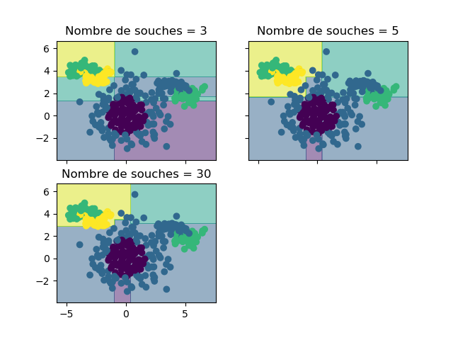
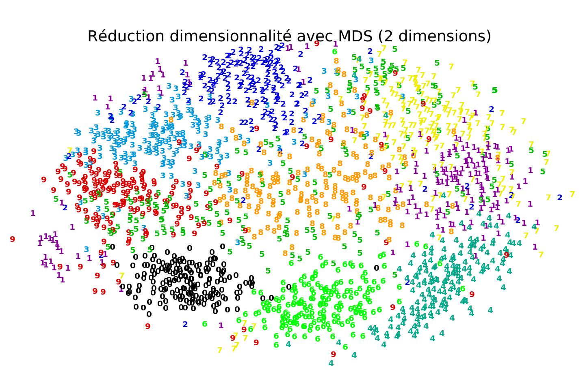

```{r setup, include=FALSE}
knitr::opts_chunk$set(echo = TRUE)
```

# Question 1

Dans la première question, il faut utiliser des techniques d'apprentissage non-supervisé pour en savoir plus sur les causes du cancer du sein, selon le jeu de données *Wisconsin Breast Cancer*. Ainsi, nous utiliserons le *clustering* pour tenter de former des groupes d'observations similaires entres elles et ainsi comprendre davantage les différences entre les tumeurs bénignes ou malignes.

## Partie a

Dans la première partie de la question 1, nous allons utiliser l'algorithme *K-means* et évaluer les groupes formés selon 3 métriques différentes. Ces métriques nous permettrons entres autres de savoir si le regroupement nous amène de l'information pertinente quant au type de cancer. Les 3 métriques sont:

- l'indice de Rand ajusté
- le score basé sur l'information mutuelle
- la mesure V

Pour être mesure de former des groupes, l'algorithme *K-means* requiert qu'on décide d'avance le nombre de groupes qui sera formé. Pour nous permettre de faire le bon choix quant au nombre de groupes, nous allons plusieurs possibilités. Le graphique ci-dessous montre les 3 différentes métriques mentionnées plus haut en fonction du nombre de groupes.


À partir de la figure 1, on peut conclure que plus le nombre de groupes est élevé, plus cela semble améliorer les métriques. Cependant, l'amélioration devient de moins en moins importante lorsque le nombre de groupes dépasse un certain nombre. De plus, un nombre de groupes trop élevé peut causer des problèmes en généralisation alors que cela pourrait avoir un impact significatif sur la variabilité de l'information contenue dans les groupes. Ainsi, il serait approprié de garder un nombre de groupes plus faible, mais quand même performant comme $K=6$.

## Partie b

Dans cette partie, on réutilise le même genre de démarche qu'à la partie a) afin de déterminer le nombre de groupes à conserver. Cependant, nous allons utiliser notre implémentation de l'algorithme EM (voir code). La figure 2 présente les 3 mêmes mesures qu'en a) pour l'algorithme EM initialisé aléatoirement.


À partir de la figure 2, on peut conclure que de choisir 2 groupes serait probablement le meilleur choix étant donné la performance élevée à ce point. On remarque d'ailleurs beaucoup de variabilité dans les résultats par la suite.

## Partie c

Dans la partie précédente, nous avons initialisé l'algorithme EM aléatoirement. Dans cette partie, nous allons initialiser la paramétrisation $\Phi$ en utilisant l'algorithme *K-Means*. La figure 3 illustre les résultats des 3 différentes métriques en utilisant cette initialisation.


Comme à la partie b), il est possible de conclure que $K=2$ nous donne les meilleures performances.

## Partie d

En analysant les résultats des 3 sections précédentes, il est possible de conclure que l'algorithme EM fonctionne beaucoup mieux lorsqu'il est initialisé par *K-Means*. Cela est assez intuitif considérant le fait qu'en étant initialisé de cette manière, les centres sont déjà beaucoup plus près de leurs valeurs optimales, ce qui réduit la volatilité des résultats comparativement à l'initialisation aléatoire.

De plus, on remarque qu'il y a un pic de performance à $K=2$ pour EM initialisé avec *K-Means*. Ce pic est en grande partie expliqué par le fait que les données sont distribuées pour une variable réponse binaire (tumeur maligne ou bénigne). En initialisant avec l'algorithme *K-Means*, celui-ci vient recentrer les moyennes des groupes en ajoutant une composante de covariance. Si on ajoute des groupes, cela diminue les performances, car l'algorithme tente de trouver des nouveaux groupes et dilue l'information qui peut être contenue dans 2 groupes seulement.

Finalement, lorsqu'on compare l'algorithme *K-Means* avec l'algorithme EM pour une loi normale multivariée, on remarque tout d'abord que le premier est un cas particulier du deuxième. En effet, les deux algorithmes fonctionnent de manière itérative. La première étape consiste à trouver les appartenances des observations selon une paramétrisation $\Phi$, alors que la deuxième étape consiste à maximiser cette paramétrisation $\Phi$ sachant les appartenances. Aussi, les deux algorithmes requiert de déterminer d'avance un nombre de groupes à trouver. Cependant, l'algorithme EM détermine l'appartenance des observations en pondérant avec des probabilités qu'une observation $\textbf{x}^\text{T}$ a de se retrouver dans un *cluster* spécifique ($G_j$). L'algorithme *K-Means* utilise quant à lui des distances et détermine l'appartenance de manière binaire.

# Question 2

Dans cette question, nous allons utiliser un jeu de données textuelles pour essayer de prédire si une instance est un pourriel ou un courriel pertinent. Pour ce faire, chaque instance a été vectorisée vers 1000 variables, où chaque variable correspond à la présence d'un mot. Afin de faciliter l'apprentissage et diminuer l'effet du fléau de la dimensionnalité, il faut représenter, de manière intelligente, les données dans un nouvel espace plus petit.

## Partie a

Dans la première partie, nous allons utiliser des techniques de sélection univariées comme le test du $\chi^2$ et le critère d'information mutuelle. Une fois la sélection de variables terminée, voici les variables (ou les mots) conservées par chacune des méthodes.

$$
\begin{tabular}{ |c|c|  }
 \hline
 Test du chi2 & Critère d'information mutuelle \\
 \hline
 \hline
 click & click \\
 \hline
 debian & debian \\
 \hline
 archive & archive \\
 \hline
 please & please \\
 \hline
 debian-user-request & debian-user-request \\
 \hline
 receive & rights \\
 \hline
 hibody & receive \\
 \hline
 newsletter & hibody \\
 \hline
 policy & policy \\
 \hline
 privacy & privacy \\
 \hline
\end{tabular}
$$
Dans le tableau ci-dessus, on remarque que les deux méthodes ont sélectionné des variables (ou mots) très similaires. Lorsqu'on compare les performances de ces modèles, on remarque qu'un *SVM* linéaire obtient des performances de $82.7\%$ sur les jeux de données réduits ($\chi^2$ et critère d'information mutuelle) tandis qu'avec le jeu de données initiales (1000 variables), nous obtenons des performances de $93.7\%$. Il est d'ailleurs intuitif de constater qu'avec le maximum d'information, les performances sont plus élevées. Toutefois, il est intéressant de constater ici qu'en laissant tombé $99\%$ de l’information (990 variables), nous obtenons des performances potentiellement très raisonnables. Le modèle est d'ailleurs beaucoup plus simple avec seulement 10 variables.

## Partie b

Dans cette partie, nous allons utiliser une technique de sélection de variables séquentielle. Le tableau ci-dessous illustre quelles variables ont été conservées dans le modèle final.

$$
\begin{tabular}{ |c|c|  }
 \hline
 Selection séquentielle arrière \\
 \hline
 \hline
 click \\
 \hline
 debian \\
 \hline
 hibody \\
 \hline
 stuff \\
 \hline
 newsisfree \\
 \hline
 redhat \\
 \hline
 archives \\
 \hline
 lawrence \\
 \hline
 africa \\
 \hline
 egroups \\
 \hline
\end{tabular}
$$
Certains mots recoupent ceux trouvés dans la partie a). Par exemple, la variable *click* est peut-être un signe que le courriel incite le destinataire à cliquer sur des liens en particulier pour vendre des choses ou souscrire à des comptes. Ce qui est peut-être un indicateur nous indiquant un pourriel.

La performance du modèle en utilisant cette méthode de sélection de variables donne une précision de $82.9\%$, ce qui est très similaire en termes de performances aux autres méthodes de sélection de variables.

## Partie c

Les algorithmes séquentiels de sélection de variables fonctionnent en ajoutant/enlevant une variable à la fois. Dans ce contexte, s'il y a des liens non linéaires complexes entres les variables, la méthode séquentielle arrière est préférable à la méthode avant. En effet, la méthode arrière aura tendance à davantage capter ces liens puisqu'elle commence en considérant toutes les variables. À l'inverse, la méthode avant commence avec un jeu de données vide pour ensuite ajouter une variable à la fois. Il est plus probable de penser que la méthode avant aura de la difficulté à capter ces liens complexes, car ces liens peuvent être fréquemment expliqués lorsque l'information est considérée de manière collective, ce que cette méthode favorise moins en partant d'un ensemble vide.  

Lorsque le nombre de variables initiales ($D$) est grand et que le nombre de variables à conserver est significativement plus petit ($K$), la méthode séquentielle arrière peut devenir non-efficace. La raison est que l'entraînement est plus difficile lorsqu'il y a beaucoup de variables et dans ce cas spécifique on doit faire beaucoup d'entraînements complexes du modèle avant d'arriver à un modèle final. Dans ce cas-ci, la méthode séquentielle avant peut devenir préférable.

# Question 3

Dans cette question, l'objectif est d'utiliser les méthodes par ensemble pour améliorer les performances en classification. Les méthodes par ensemble permettent de combiner plusieurs classifieurs ensembles afin de mettre de l'avant le concept de la sagesse des foules (*wisdom of the crowds*). Il existe plusieurs manières de combiner ces modèles.

## Partie a

Dans cette première partie, nous allons utiliser un algorithme d'ensemble qui s'appelle *AdaBoost*. Cette méthode permet de combiner plusieurs modèles en faisant du *boosting*. Nous allons tester l'algorithme avec des arbres de décisions à 1 seul niveau (souches de décision) ainsi que des arbres de décisions à 3 niveaux.

la figure 4 illustre les performances de l'algorithme *AdaBoost* sur des souches de décisions en fonction du nombre d'estimateurs. Ce nombre est en fait un hyperparamètre que nous devons définir en réalité, en utilisant par exemple une recherche en grille.


La figure 5 illustre les zones de décisions selon le nombre de souches considéré dans le modèle. Les points correspondent aux observations du jeu de données test.



Les figures 6 et 7 sont similaires aux figures 4 et 5, mais pour l'algorithme *AdaBoost* considérant des arbres de décisions à 3 niveaux à la place de souches de décision.


## Partie b

Lorsqu'on analyse les résultats présentées dans la section a), nous pouvons conclure que les souches de décisions ne semblent pas suffisants pour avoir de bons résultats le cas ci-présent. En effet, certains groupes sont difficiles à discriminer lorsqu'on utilise des souches de décisions. Les arbres de décisions à 3 niveaux donnent des performances bien meilleures, car ceux-ci permettent de modéliser le jeu de données avec une plus grande complexité.

Maintenant que nous avons conclu qu'il est préférable d'utiliser les arbres de décisions, il reste à déterminer combien d'arbres (ou classifieurs) nous voulons conserver. En se fiant à la figure 6, on peut conclure que 40 arbres semblent donner de bonnes performances.

## Partie c

Une autre méthode d'ensemble très populaire est la forêt aléatoire. Dans la figure 8, nous avons calculé les performances selon la profondeur maximale des arbres de décision. La figure 9 illustre quant à elle les zones de décision calculées par l'algorithme selon différentes profondeurs maximales.


À partir de la figure 8, on peut conclure que lorsqu'on augmente la profondeur maximale, cela augmente les performances jusqu'à atteindre un point où les améliorations sont observées sur le jeu de données d'entraînement seulement. Cela nous indique un sur-apprentissage de l'algorithme. Ce point survient approximativement à une profondeur de 4. Pour cette raison, la profondeur optimale dans ce cas-ci serait de 4. On peut d'ailleurs observer sur la figure 9 que les zones de décisions apprises sont assez performantes pour le jeu de données test.

# Question 4

L'objectif de cette question est de comparer différentes techniques de réduction de dimensionnalité. Plus particulièrement, nous allons comparer les 3 méthodes suivantes:

1. L'analyse en composantes principales (PCA)
2. Le positionnement multidimensionnel (MDS)
3. t-SNE

Dans un contexte d'apprentissage automatique et d'analyse de données, les techniques de réduction de dimensionnalité ont plusieurs utilités comme la visualisation ou la compression d'information. Il est également possible de penser que cela peut servir à contrer le fléau de la dimensionnalité, alors que l'apprentissage devient beaucoup plus facile dans un espace à plus petite dimension.

## Partie a

Comme mentionné un peu plus tôt, une des fonctions les plus populaires derrière la réduction de dimensionnalité consiste à pouvoir visualiser des données de hautes dimensions en réduisant l'espace à deux dimensions seulement. Les figures 10, 11 et 12 correspondent aux projections 2D du jeu de données *digits* selon les 3 méthodes mentionnées plus haut.





En analysant les 3 figures, on remarque que l'analyse en composantes principales et le positionnement multidimensionnel donnent des résultats similaires. Par contre, la méthode t-SNE donne des résultats très intéressants alors qu'il est facile de constater les différents groupes. En réduisant la dimension de cette façon, il serait plutôt facile de construire un discriminant par-dessus et faire la classification de manière assez performante.

## Partie b

Dans la figure 12, on remarque que la méthode t-SNE réussit à bien séparer la majorité des classes du jeu de données dans un espace à 2 dimensions. Cependant, on remarque que certaines observations appartiennent à une classe spécifique, mais sont néanmoins placées à proximité d'un groupe d'une autre classe dans l'espace 2D. Par exemple, certaines observations de la classe "9" sont très près de certains "3", "1" ou même "7".

Les figures 13, 14 et 15 sont des exemples d'observations très similaires dans l'espace réduit par t-SNE, mais de classes différentes.


En conclusion, puisque ce sont des chiffres écrits à la main, certaines observations sont évidemment bien différentes des autres observations de la même classe, et peut même ressembler beaucoup à une observation d'une autre classe.

## Partie c

À la partie b), nous avons vu que certaines observations font parties d'une classe spécifique, mais ressemblent beaucoup plus aux observations d'une autre classe. En effet, certaines classes ont un plus grand "potentiel" d'être confondues avec une autre classe. Par exemple, la figure 12 nous montre que les observations de la classe "0" sont rarement confondues avec celles d'une autre classe. Pour avoir une idée quelle classe sont les plus susceptibles d'être confondues, nous pouvons faire un ratio entre la distance *intra-classe* et la distance *inter-classe*. Plus ce ratio est petit, plus la classe est concentrée dans un espace compact et distant des autres classes. Ces ratios pour chacune des méthodes de réduction (y compris sans réduction) sont présentés dans le tableau ci-dessous.

$$
\begin{tabular}{ |c|c|c|c|c|  }
 \hline
 Classe & Ratio avec PCA & Ratio avec MDS & Ratio avec t-SNE & Ratio sans réduction \\
 \hline
 \hline
 0 & 0.29 & 0.21 & 0.1 & 0.55 \\
 \hline
 1 & 0.58 & 0.82 & 0.48 & 0.81 \\
 \hline
 2 & 0.4 & 0.4 & 0.16 & 0.74 \\
 \hline
 3 & 0.46 & 0.38 & 0.2 & 0.71 \\
 \hline
 4 & 0.37 & 0.32 & 0.17 & 0.72 \\
 \hline
 5 & 0.75 & 0.86 & 0.22 & 0.77 \\
 \hline
 6 & 0.3 & 0.26 & 0.14 & 0.62 \\
 \hline
 7 & 0.35 & 0.48 & 0.15 & 0.72 \\
 \hline
 8 & 0.56 & 0.54 & 0.24 & 0.81 \\
 \hline
 9 & 0.51 & 0.52 & 0.46 & 0.77 \\
 \hline
\end{tabular}
$$

Le dernier tableau nous permet de valider que la classe "0" est relativement facile à regrouper. Il en va de même pour les classes "6" et "4". Cependant, on remarque que les classes "9" et "1" ont des ratios élevés, et ce, même avec la méthode la plus performante (t-SNE). Ces ratios peuvent d'ailleurs être facilement confirmés avec les figures de projection en 2D. On remarque également que lorsqu'on ne fait aucune réduction de dimensionnalité, il est très difficile de distinguer les différentes classes (à l'exception peut-être du "0"). Dans ce contexte, la réduction de dimension nous permet donc de regrouper l'information dans un espace plus propice à l'apprentissage.


